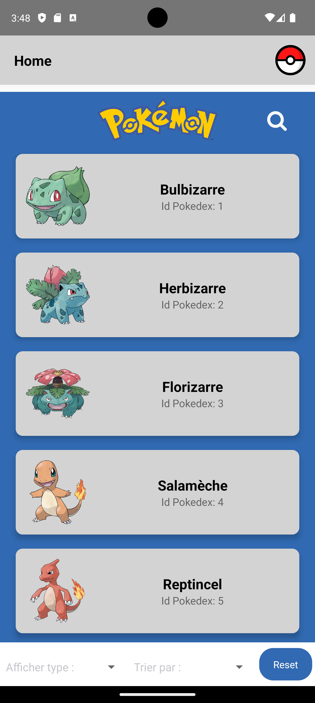
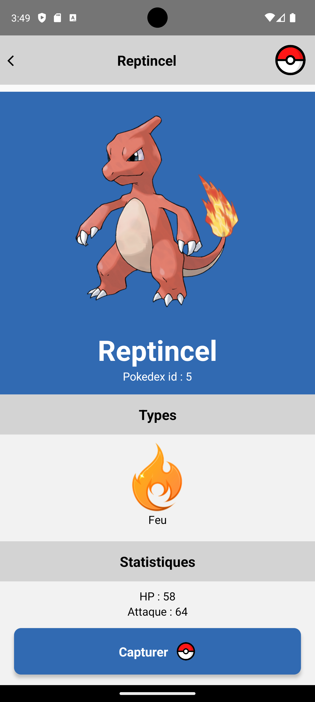

# Pokedex Mobile Application

## Presentation
This is a project carried out during my developer training.  
The goal was to create a mobile application of Pokedex.

## Stacks used
- Javascript
- React Native
- Redux
- React Navigation
- Redux ToolKit
- React Native Picker
- React Native Vector Icons

## API
The data comes from the great API of
[PokeBuild](https://pokebuildapi.fr/api/v1)

## Features
- Display loader during the loading of the data
- List of all pokemons
- Search for a pokemon by name and by pokedex id
- Filter by type and by pokedex id
- Display pokemon by type
- Display of the details of a pokemon
- Display of the evolution chain of a pokemon
- Display of the types of a pokemon
- Display of the stats of a pokemon
- Capture a pokemon, add it to a collection
- Display modal during capture
- Remove a pokemon from a collection
- Release a pokemon, remove it from the collection
- Clear the collection of pokemons
- Display of the collection of pokemons
- Display how many pokemons are in the collection

## Getting Started
1. Clone the repository
2. Install Android Studio
3. Create an Android Virtual Device
4. You need to have [Node.js](https://nodejs.org/en/) installed on your machine 

5. Install the dependencies
```bash
npm install
```
6. Start the project
```bash
npm start
```


## Screenshots

Loader  


Home page  


Display search bar  


Search by name  


Display select input to filter by type  


Display Select input to sort  


Details of a pokemon  


Modal to capture a pokemon  


Collection of pokemons  


Empty collection  


## Mockup
You can find the mockup of the application in the directory `maquette`

## Credits
- [PokeBuild](https://pokebuildapi.fr/api/v1)
- Pikachu gif by [BenKuhlmann](https://lottiefiles.com/gh1hzif5dgptoco2)
- Others pictures by [The Pokémon Company International on Tumblr](https://pokemon.tumblr.com/)
